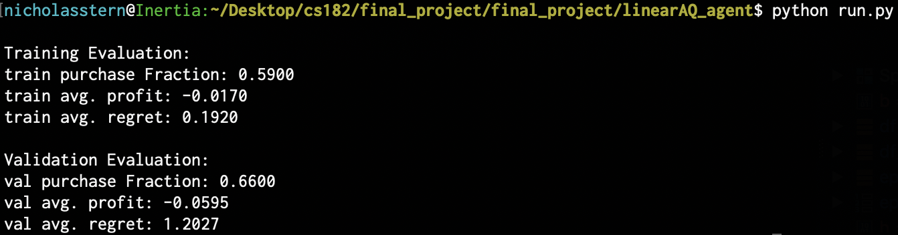

# Predicting Stock Trends w/ Reinforcement Learning
## Julien Laasri, Nicholas Stern, Ziyi (Queena) Zhou
### Harvard Artificial Intelligence Final Project Fall 2018

## Introduction
The goal of our project was to use reinforcement learning to identify
implicit stock trends, and train an agent to decide on the best time 
to buy a stock within a given time frame. The full description of the 
problem framework and development/evaluation of the agents can be found in
the final report pdf located in the top level of the repo.

## How to use

There are 4 agents in the repo that can be run. They reside in the following
four directories:

- Baseline_agent: An agent that obeys simple logic to set a standard
- Q_agent: An epsilon-greedy Q-learning agent
- linearAQ_agent: An epsilon-greedy approximate Q-learning agent that 
uses linear function approximation
- NNQ_agent: An epsilon-greedy approximate Q-learning agent that 
uses neural nets to perform function approximation

### Input

Within each of the directories are two important .py files. One will be a
variation of the agents name, containing a class that defines the agent. The other
is run.py, which is the only file the user needs to interact with. Simply type

```bash
$ python run.py
```

to run each agent. The Q-learning agent gives one the option to specify 
the input parameters. To see all the command line options with descriptions,
type

```bash
$ python run.py -h
```

For the rest of the agents, in order to change the parameters, the user can
simply edit the run.py file where the initializations are made.

### Output

Each approximate Q learning agent will output the agent's performance on the
training and validation sets. The metrics for evaluation are average profit, 
the average regret (see paper for in depth description), and the fraction
of times the agent decided to buy. An example output looks like this:



The exact Q-learning agent is not evaluated the same way by default, and will
instead output an accuracy score for its decisions, and the fraction of 
its decisions that were purchases.

We have four companies' stock data, from Apple, Amazon, Google, Microsoft. To compare our four agents' performance on one particular company, open the file in the main directory called 'agent\_evaluation.py'. Locate the comment line that says '\# Parameter Initializations'. Under this line, change the company name to be the one you want to look at. For example, if I want to look at Microsoft's stock, I will type:

```bash
company = "Microsoft"
```

Then in your command line, type:

```bash
$ python agent_evaluation.py
```

After the code finishes running, you should be able to see a newly created '.csv' file, in the 'results' folder, that summarizes the performance of four agents. You also create a histogram graph in the 'images' folder.